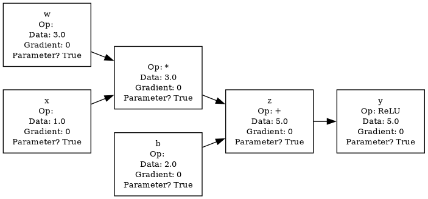
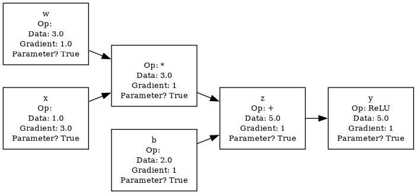

# my-autograd

<!-- WARNING: THIS FILE WAS AUTOGENERATED! DO NOT EDIT! -->

Documentation at https://lawjarp-a.github.io/my-autograd/

## Install

``` sh
pip install my_autograd
```

## How to use

Derive from the class `Value`. Use that to define the scalar values that
you will use to implement backpropagation. Use the `backward()` method
to compute the gradients.

``` python
# Define a Linear layer
w = Value(3.0, label='w')
b = Value(2.0, label='b')
x = Value(1.0, label='x')

z = (w * x) + b; z.label = 'z'

y = z.relu(); y.label = 'y'
```

``` python
# Visualize the graph
draw_dag(y)
```



``` python
# Call the backward method to compute gradients
y.backward()
```

``` python
# Visualize the graph again
draw_dag(y)
```


